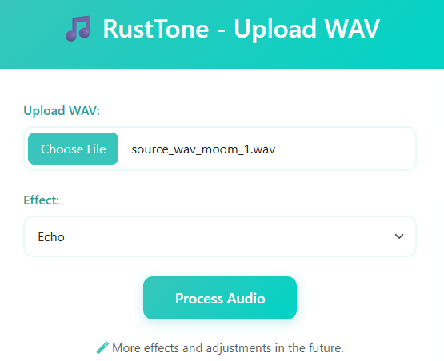

# RustTone — Guitar Effect Processor (Rust CLI)

<p align="center">
  
  
  
  
  
</p>

RustTone is a command-line tool for applying guitar audio effects using the Rust programming language.
It implements **Single Echo** and **Multiple Echo** effects based on classic DSP principles derived
from academic Signal and Systems coursework. RustTone reads `.wav` audio files, processes them, and
writes the output to a new `.wav` file.

## ✨ Demos

You can view demo at.

https://rusttone.porrapat.com



## 📄 Reference Paper

This project’s DSP algorithms are derived from the academic paper referenced below:

👉 [Paper Guitar Effect](https://github.com/Porrapat/rusttone/blob/master/paper_project_effect_guitar.pdf)

## ✨ Features

- Read & write uncompressed WAV files using `hound`
- Single Echo filter  
  `y[n] = x[n] + a·x[n − R]`
- Multiple Echo filter (finite number of echoes)  
  `y[n] = x[n] + a·x[n−R] + 2a·x[n−2R] + ... + N a·x[n−NR]`
- Clean CLI interface powered by `clap`
- No `unsafe` code, portable across all major platforms

---

## 📦 Installation

Clone the repository:

```
git clone https://github.com/Porrapat/rusttone.git
cd rusttone
```

Build the tool:

```
cargo build --release
```

The final binary is located at:

```
target/release/rusttone
```

## 📦 Server Installation

Build the tool:

```
cargo build --release --bin rusttone-server
```


---

## 🚀 Usage

RustTone accepts subcommands:

```
rusttone <effect> <input.wav> <output.wav> <delay> <a> [extra parameters]
```

---

# 🎧 1) Single Echo

Applies:  
**y[n] = x[n] + a·x[n − R]**

Example:

```
rusttone single input.wav output.wav 8000 0.5
```

### Parameters
- `input.wav` – Source file  
- `output.wav` – Output file  
- `delay` – Number of samples to delay (R)  
- `a` – Echo attenuation (0 < a < 1)

---

# 🌊 2) Multiple Echo

Applies:  
**y[n] = x[n] + a·x[n−R] + 2a·x[n−2R] + ... + N a·x[n−NR]**

Example:

```
rusttone multi input.wav output.wav 8000 0.5 4
```

### Parameters
- `delay` – Samples between each echo  
- `a` – Attenuation  
- `N` – Number of echoes  

---

## 📂 Project Structure

```
rusttone/
│
├── src/
│   ├── main.rs        # CLI entry point
│   ├── effects.rs     # DSP functions
│
├── Cargo.toml
└── README.md
```

---

## 🛠 Dependencies

### hound  
For WAV read/write  
https://crates.io/crates/hound

### clap  
For building robust CLI interfaces  
https://crates.io/crates/clap

---

## 🔥 Example

Apply a simple echo:

```
rusttone single guitar.wav guitar_echo.wav 5000 0.6
```

Apply multiple echoes:

```
rusttone multi guitar.wav guitar_multi.wav 6000 0.4 5
```

---

## 🧑‍💻 Author

This project was developed collaboratively with ChatGPT as part of modernizing
a university DSP project into a clean, modern Rust-based version.

---

## 📜 License

MIT License
